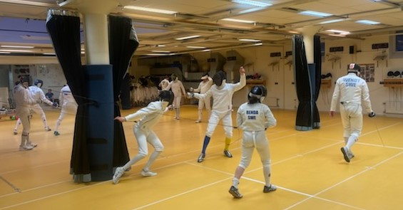

```{r preparations, message=FALSE, warning=FALSE, include=FALSE}
# Load  libraries
library(tidyverse)
library(here)
library(janitor)
library(kableExtra)
library(blogdown)
library(gt)

# Get data
results <- read_csv2(here("files", "results2022.csv"))

# Clean data
results_clean <- results %>%
  # make long dataframe
  pivot_longer(!name, names_to = "comp_no", values_to = "place") %>% 
  # get competition number
  separate(comp_no, into = c(NA, "comp_no")) %>%
  clean_names()
```

```{r source-points-calc, message=FALSE, warning=FALSE, include=FALSE}
source(here("files", "calculate_points.R"))
```



### De unga utmanar

Helgen innan den 3:e deltävlingen hade FFF:s juniorer och ungdomar slagit fäktvärlden med häpnad genom sin framfart och tagit flera glimmande medaljer som byte. Därför var det inte konstigt att se de ängsliga ansiktsuttrycken hos de gamla ärrade krigarna, som hittills varit så framgångsrika i årets vårcupstävlingar. De förstod att deras tid på tronen skulle utsättas för hårda prövningar.

#### Poulfäktningen

Mycket riktigt tog också den nya generationen ett stadigt tag i taktpinnen direkt från start. Elvira som förvisso inte längre är junior men ändå utgör stommen i klubbens framtidsbygge, gjorde rent hus i sin poule. På vägen tvingade hon segraren från den första deltävlingen - Janne - på knä. Tack vare detta gick hon vidare med en 2:a ranking till tävlingens nästa skede.  

Ian, som fortfarande var yster efter sin fina 3:e plats på JSM, följde Elviras exempel genom att, förutom en knapp 4-5 förlust vinna samtliga sina matcher i sin poule och därmed säkra en 3:e ranking till direktelemineringen. I sin framfart kunde Ian bland andra räkna in CH på sin segerlista.  

I den tredje poulen kunde Tor med nöd och näppe tvinga till sig en vunnen match i poulen och gick därmed in i direktelimineringen med en för honom blygsam 12:e ranking. I samma poule höll dock Joakim hov och med en slug fäktning kunde han glädja sig åt en välförtjänt 1:a ranking inför direkteliminationen.

#### Direktelimineringen

Både Elvira och Ian fortsatte på sin inslagna väg i direktelimineringen ända tills de gick bet på Lucas, som var en av kvällens stora överraskningar. Med knappast möjliga marginal lyckades den Lucas ta sig förbi Elvira i kvartsfinalen, för att sedan betvinga Ian i semin.

I tablåns andra halvan hade samtidigt Greger fått upp ångan och lyckades, med hjärtat i halsgropen, ta sig förbi den stekheta Joakim i kvartsfinalen. Först i semifinalen fick Greger se sig besegrad av Tor, som nu hade kvicknat till liv.

#### Kampen om pallplatserna

Därmed ställdes Lucas mot Tor i finalen, medan Greger fick ta sig an Ian i matchen om 3:e priset. Matchen om bronset blev jämn, men till sist kunde Greger, med resoluta aktioner vända matchen till sin fördel och tog sin första pallplats för året.

I finalen fick Lucas känna av hur det känns att stå i vägen för Tor när denne väl fått upp oljetrycket. Trots en heroisk insats fick Lucas till sist nöja sig med en fantastisk 2:a plats. Mot Tor fanns inte annat att göra än att gratulera till den andra raka segern.

Här ser ni den fullständiga resultatlistan från den 3:e deltävlingen.

```{r make-table, echo=FALSE, message=FALSE, warning=FALSE}
# choose which competitions to include to enable reproducibility
# in this case the competition 1-3 are selected
comp_res <- results_clean %>% 
  filter(comp_no == 3) %>% 
  # Calculate points for the competition
  calculate_points()

# Prepare data for the result table
df <- comp_res %>%
  select(-comp_no) %>% 
  arrange(place) %>% 
  drop_na(place) %>% 
  rename(Namn = name, Placering = place, Poäng = points)

# Create table output using kableExtra package
# kable(df) %>%
#  kable_styling(bootstrap_options = "striped", full_width = F, position = "left")

df %>% gt()

```

Med tre genomföra tävlingen kan vi konstatera att Tor har tagit en betryggande tätposition så här långt. Efter honom är det fortfarande de rutinerade fäktarna Janne och CH som håller sig framme, men underifrån kommer utmanarna. Lucas har tagit ett rejält kliv uppåt och Elvira, Ian och Louise är alla bland top 10. Notera också att både Karsten och Greger endast deltagit i en deltävling. Med ytterligare två tävlingar att se fram emot kommer vi säkert att se fler omflyttningar i tabellen framöver.

```{r create-grand-totals-table, echo=FALSE, message=FALSE, warning=FALSE}
# Create overall standings table ----

## Calculate grand total points for all competitions (1-2)
total <- results_clean %>% 
  # filter for competition
  filter(comp_no < 4) %>%
  calculate_points() 

# prepare standings table
piv_total <- total %>%
  select(-place) %>% 
  pivot_wider(
    names_from = comp_no, 
    values_from = points,
    names_prefix = "comp_"
)

## Calculate grand total points for all competitions (1-3)
grand_tot <- total %>% group_by(name) %>%
  summarise(sum_points = sum(points, na.rm = TRUE)) %>% 
  arrange(desc(sum_points))
# View(grand_tot)


# Create new piv df with totals column
res <- piv_total %>%
  full_join(grand_tot, by = "name") %>% 
  arrange(desc(sum_points))
  
# Add ranking
res <- res %>% 
  mutate(rank = min_rank(desc(sum_points))) %>% 
  relocate(rank, everything())

# Rename columns for final table Note: change for each competition!!
standings <- res %>% rename("#" = "rank", "Namn" = "name", 
                            "1" = "comp_1", "2" = "comp_2",
                            "3" = "comp_3",
                            "Summa Poäng" = "sum_points")

# Create tabel output using kableExtra package
# kable(standings) %>%
#   kable_styling(bootstrap_options = "striped", full_width = F, position = "left")

standings %>% gt()

```

Det återstår bara att tacka alla som deltog och uppmana alla att anstränga sig till det yttersta på träningarna fram till den 28 april för då bär det av igen!
